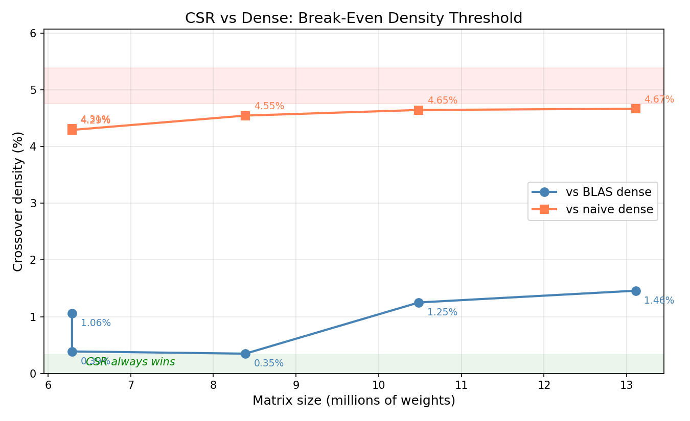

# Sparse CSR vs Dense Representation: Benchmark Report

## Experiment Setup

Five benchmark runs (`bob_results_0` through `bob_results_4`) measured sparse
CSR attention time (`attn_time`) against two dense baselines:

- **ref_time** — naive dense matrix multiply (no BLAS)
- **blas_time** — optimized BLAS (OpenBLAS) dense multiply

Each run sweeps density from 0.01% to 100% on matrices of increasing size.
A sixth file (`timing-bob.csv`) provides fine-grained density steps (1%
increments) at ~6.5M weights but has no dense baseline for direct comparison.

| Run | n_weights | total_mem | ref_time (µs) | blas_time (µs) |
|-----|----------:|----------:|--------------:|---------------:|
| 0   | 6,291,456 | 59,768,832 | 150,467 | 20,099 |
| 1   | 6,291,456 | 55,050,240 | 142,731 | 4,961 |
| 2   | 8,388,608 | 75,497,472 | 257,030 | 6,988 |
| 3   | 10,485,760 | 96,993,280 | 403,082 | 71,937 |
| 4   | 13,107,200 | 125,337,600 | 639,979 | 138,200 |

## Combined Per-Density Table: Sparse attn_time (µs)

| Density | bob_0 | bob_1 | bob_2 | bob_3 | bob_4 |
|--------:|------:|------:|------:|------:|------:|
| 0.01% | 50 | 66 | 85 | 147 | 234 |
| 0.02% | 100 | 111 | 151 | 305 | 443 |
| 0.03% | 215 | 208 | 316 | 625 | 867 |
| 0.06% | 490 | 421 | 652 | 1,202 | 1,689 |
| 0.10% | 874 | 858 | 1,294 | 2,297 | 3,277 |
| 0.18% | 1,769 | 1,789 | 2,732 | 4,617 | 6,974 |
| 0.32% | 3,709 | 3,807 | 6,151 | 10,025 | 15,884 |
| 0.56% | 7,874 | 7,988 | 13,555 | 21,685 | 35,211 |
| 1.00% | 17,906 | 15,909 | 30,897 | 51,581 | 81,843 |
| 1.78% | 46,280 | 44,031 | 74,214 | 114,948 | 177,855 |
| 3.16% | 100,203 | 97,169 | 161,262 | 247,047 | 363,000 |
| 5.62% | 207,270 | 195,958 | 331,050 | 505,262 | 814,605 |
| 10.00% | 424,316 | — | 685,938 | 1,076,446 | 1,647,120 |
| 17.78% | 768,154 | — | 1,222,346 | 1,888,211 | 2,997,694 |
| 31.62% | 1,355,115 | — | 2,149,019 | 3,352,297 | 5,311,837 |
| 56.23% | 2,720,411 | — | 4,664,980 | 7,276,583 | 11,512,464 |
| 100.00% | 6,234,552 | — | 11,020,754 | 17,245,671 | 26,790,027 |

## Crossover Thresholds

The density at which sparse CSR becomes **slower** than the dense baseline
(linearly interpolated between measured points):

| Run | n_weights | vs naive dense | vs BLAS |
|-----|----------:|---------------:|--------:|
| 0   | 6,291,456 | 4.31% | 1.06% |
| 1   | 6,291,456 | 4.29% | 0.39% |
| 2   | 8,388,608 | 4.55% | 0.35% |
| 3   | 10,485,760 | 4.65% | 1.25% |
| 4   | 13,107,200 | 4.67% | 1.46% |

### Observations

1. **vs naive dense (~4.3–4.7%):** The crossover is remarkably stable across
   matrix sizes. CSR overhead scales proportionally with the dense baseline,
   keeping the break-even density nearly constant.

2. **vs BLAS (~0.35–1.5%):** Much more variable. BLAS performance depends
   heavily on cache utilization and tuning, so the crossover shifts with matrix
   dimensions. The two runs at n_weights=6.3M gave very different blas_times
   (20ms vs 5ms), suggesting BLAS performance is sensitive to matrix shape
   and alignment.

3. **Rule of thumb:**
   - **< 1% dense** → CSR always wins, even against BLAS
   - **1–5% dense** → CSR wins vs naive, but may lose to BLAS
   - **> 5% dense** → dense representation wins in all cases

## Memory: CSR vs Dense

At 100% density, CSR memory (mem_k + mem_q + mem_v) vs dense (total_mem):

| Run | dense (MB) | CSR at d=1.0 (MB) | CSR overhead |
|-----|----------:|-----------------:|---------:|
| 0   | 57.0 | 83.6 | 1.47× |
| 2   | 72.0 | 105.5 | 1.47× |
| 3   | 92.5 | 135.6 | 1.47× |
| 4   | 119.5 | 184.3 | 1.54× |

CSR at full density costs ~47–54% more memory than a flat dense array, due to
the column-index and row-pointer arrays. This overhead only pays off when the
matrix is sparse enough that most entries are zero and can be omitted.

The memory crossover (where CSR uses less memory than dense) is at roughly
**68% density** (1/1.47), since CSR stores both values and indices.

---

## Note: BTree vs Binary Search for CSR Column Lookup

`btree_overhead.csv` measures the storage overhead of a dense B-tree
(KEYS_PER_NODE = 16) used for column-index lookup within CSR rows, compared
to a flat sorted array with binary search.

### BTree Storage Overhead

| n (elements) | internal_len | total_len | overhead % |
|-------------:|-------------:|----------:|-----------:|
| 16 | 0 | 16 | 0.0% |
| 17 | 16 | 33 | 94.1% |
| 100 | 16 | 116 | 16.0% |
| 256 | 16 | 272 | 6.3% |
| 257 | 48 | 305 | 18.7% |
| 1,000 | 80 | 1,080 | 8.0% |
| 5,000 | 368 | 5,368 | 7.4% |
| 10,000 | 704 | 10,704 | 7.04% |

The overhead exhibits a sawtooth pattern — it spikes whenever a new tree level
is introduced (at n = B^k + 1), then decays as the level fills up.
Asymptotically it converges to **1/(B−1) = 1/15 ≈ 6.67%** overhead.

### Tradeoffs: BTree vs Binary Search

| Property | Sorted array + binary search | Dense BTree (B=16) |
|----------|-----------------------------|--------------------|
| Memory overhead | 0% | ~7% asymptotic |
| Lookup complexity | O(log₂ n) comparisons | O(log₁₆ n) node visits |
| Cache behavior | Poor — each comparison jumps to a distant cache line | Good — each node (16 keys) fits in 1–2 cache lines |
| Worst-case cache misses | log₂ n | log₁₆ n ≈ log₂ n / 4 |
| Insert/delete | O(n) — must shift elements | O(B · log_B n) — local node splits |
| Practical sweet spot | Small rows (< 64 nnz) or read-only data | Larger rows (> 64 nnz) or mutable data |

For CSR matrices that are built once and never modified (the common case in
SpMV/SpMM), binary search on a flat array is hard to beat: zero overhead, and
the access pattern during matrix-vector multiply is sequential rather than
random, so binary search's poor cache behavior matters less.

The BTree pays off when:
- Rows are large enough that 7% memory overhead is negligible
- Random-access lookups dominate (e.g., checking whether a specific (i,j) entry exists)
- The structure needs to support incremental insertion

For the matmul workloads in this benchmark suite, where CSR rows are scanned
linearly, the BTree's cache advantage is largely neutralized. Its main value
is in construction and random-access query patterns.
